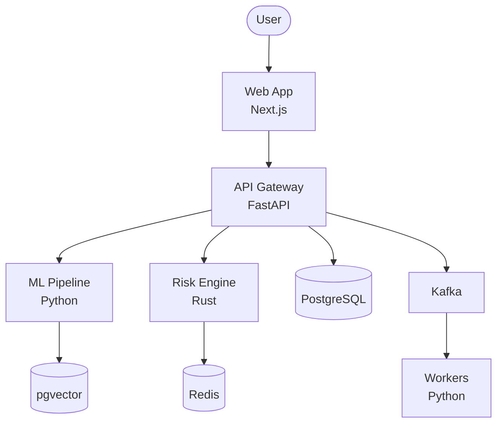

# Architecture & Design Standards

## Design Process

```
Requirements → Threat Model → HLD → LLD → ADR → Implementation
```

---

## C4 Model (4 levels)

| Level | Scope | Elements |
|---|---|---|
| L1 Context | System + external actors | Users, systems, arrows |
| L2 Container | Applications, databases, queues | Services, data stores |
| L3 Component | Modules within a container | Controllers, services, repos |
| L4 Code | Classes and functions | Class diagrams (optional) |

### Mermaid Example (L2 Container)


---

## High-Level Design (HLD) Template

```markdown
# HLD: [Feature Name]

## Overview
What the feature does and why it exists.

## Architecture
- System/container diagram.
- Communication patterns (sync REST, async events).
- Data flow and ownership.

## Non-Functional Requirements
| Metric | Target |
|---|---|
| Latency (P95) | <200ms |
| Throughput | 1000 QPS |
| Availability | 99.9% |
| Data retention | 7 years |

## Scaling Strategy
Horizontal scaling, caching, partitioning.

## Security Considerations
Auth, data encryption, access control.

## Dependencies
External services, databases, third-party APIs.
```

---

## Low-Level Design (LLD) Template

```markdown
# LLD: [Module Name]

## Responsibility
Single sentence describing what this module owns.

## Public API
| Method | Input | Output | Errors |
|---|---|---|---|
| `create_portfolio` | `CreatePortfolioReq` | `Portfolio` | `ValidationError`, `ConflictError` |

## Data Structures
With time/space complexity for key operations:
- `PortfolioMap`: O(1) lookup, O(n) iteration.

## Algorithm
Pseudo-code for non-trivial logic. Document edge cases.

## Concurrency
Thread-safety model, locks, deadlock prevention.

## Error Handling
Exception hierarchy, recovery strategies.
```

---

## Design Patterns Reference

### Creational
| Pattern | When | Example |
|---|---|---|
| Factory Method | Create objects without specifying class | `LoggerFactory.create("file")` |
| Builder | Complex objects with many optional params | `QueryBuilder.select().where().build()` |
| Singleton | Single instance (use sparingly) | DB connection pool |

### Structural
| Pattern | When | Example |
|---|---|---|
| Adapter | Incompatible interfaces | Legacy API wrapper |
| Decorator | Add behavior without subclassing | Logging, caching, retry |
| Facade | Simplify complex subsystems | Service layer over repos |

### Behavioral
| Pattern | When | Example |
|---|---|---|
| Strategy | Swap algorithms at runtime | Pricing strategies |
| Observer | Event-driven notifications | Event bus, pub/sub |
| Command | Encapsulate requests | CQRS commands |
| Chain of Responsibility | Pipeline processing | Middleware chains |

### Distributed
| Pattern | When | Example |
|---|---|---|
| Circuit Breaker | Prevent cascade failures | Resilience4j |
| Saga | Distributed transactions | Order → Payment → Shipping |
| CQRS | Separate read/write models | Query DB vs Command DB |
| Event Sourcing | Audit trail, replay | Financial transactions |
| Outbox | Reliable event publishing | DB + message queue |

---

## SOLID Deep Dive

### S — Single Responsibility
```
BAD:  UserService { save, validate, sendEmail, generateReport }
GOOD: UserService { save }, Validator { validate }, Mailer { send }, Reporter { generate }
```

### O — Open/Closed
```python
# Extend via strategy, not modification
class PricingStrategy(Protocol):
    def calculate(self, base: Decimal) -> Decimal: ...

class StandardPricing:
    def calculate(self, base: Decimal) -> Decimal: return base

class DiscountPricing:
    def calculate(self, base: Decimal) -> Decimal: return base * Decimal("0.9")
```

### L — Liskov Substitution
Subtypes must honor the contract of their base type. If `Square extends Rectangle`, `setWidth()` must not break `height` invariant.

### I — Interface Segregation
```java
// BAD: one fat interface
interface Worker { void work(); void eat(); void sleep(); }

// GOOD: segregated
interface Workable { void work(); }
interface Feedable { void eat(); }
```

### D — Dependency Inversion
```python
# Depend on abstractions, not implementations
class UserService:
    def __init__(self, repo: UserRepository):  # Interface, not PostgresUserRepo
        self._repo = repo
```

---

## Microservices Patterns

1. **API Gateway**: Single entry point, routing, auth, rate limiting.
2. **Service Mesh**: Sidecar proxies (Istio/Linkerd) for observability, mTLS, traffic management.
3. **Database per Service**: Each service owns its data. No shared databases.
4. **Event-Driven**: Services communicate via events (Kafka, NATS). Eventual consistency.
5. **Strangler Fig**: Gradually migrate from monolith to microservices.
