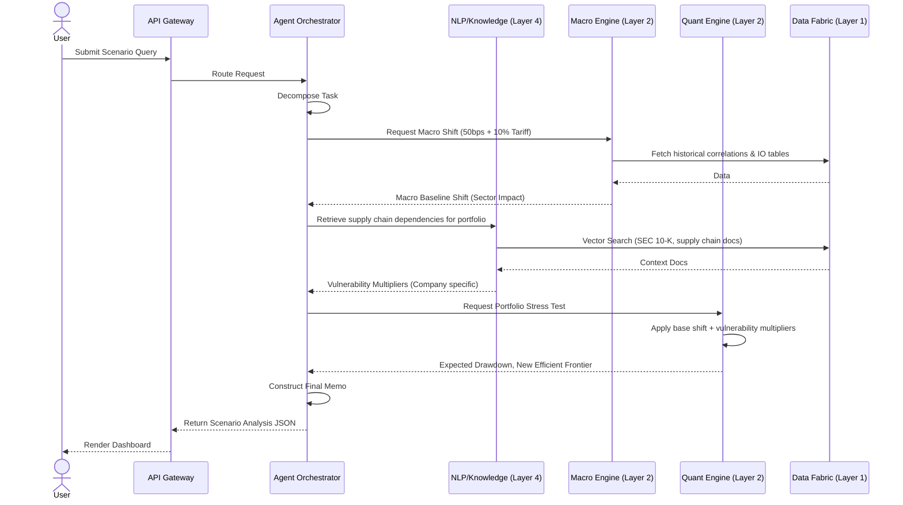

# 🏛 SYSTEM ARCHITECTURE DIAGRAMS & DESIGN

## 1. High-Level Architecture Overview

STRATOS is organized into a modular, multi-tier architecture enabling high-performance deterministic modeling alongside probabilistic ML/LLM reasoning.

```mermaid
graph TD
    %% Core Users
    subgraph Clients["Client Layer"]
        B[Web Dashboard / React]
        M[Mobile App / React Native]
        API[Direct API Access / B2B]
    end

    %% API Gateway & Edge
    AG[API Gateway / GraphQL + REST]
    
    %% Orchestration Layer
    subgraph Agent Layer["Layer 5: Agent Orchestration (Python/Go)"]
        LLM[LLM Routing Agent]
        RAG[RAG & Memory System]
        Plan[Task Planner]
    end

    %% ML / NLP Layer
    subgraph AI Layer["Layers 3 & 4: ML & NLP Stack (Python)"]
        FinBERT[NLP Models: Sentiment/Fraud]
        TS[Time Series Models: GARCH/LSTM]
        GAN[Simulation GANs]
    end

    %% Deterministic Engines
    subgraph Engine Layer["Layer 2: Deterministic Engines (Rust/Go)"]
        QE[Quant/Portfolio Engine]
        TE[Tax/Fiscal Engine]
        ME[Macro/Geo Simulation Engine]
    end

    %% Data Fabric Layer
    subgraph Data Fabric["Layer 1: Data Fabric"]
        TSDB[(TimescaleDB: Market Data)]
        R[(PostgreSQL: User/Config Data)]
        V[(Vector DB: Qdrant/Milvus)]
        KV[(Redis: Cache/Queue)]
    end

    %% Connections
    Clients --> AG
    AG --> LLM
    AG -.-> Engine Layer
    
    LLM --> Plan
    Plan --> AI Layer
    Plan --> Engine Layer
    Plan --> RAG
    
    AI Layer --> V
    AI Layer --> TSDB
    
    Engine Layer --> TSDB
    Engine Layer --> R
    
    RAG --> V
    RAG --> R
```

---

## 2. Component Design & Tech Stack

### 2.1 API Gateway & Edge Services
- **Framework**: Apollo GraphQL (for complex, nested queries) and FastAPI (for high-throughput REST endpoints).
- **Authentication**: JWT, OAuth2 (Auth0 / Clerk), Role-Based Access Control (RBAC).
- **Rate Limiting**: Redis-backed token bucket algorithm.

### 2.2 Layer 5: Agent Orchestration
This is the "Brain" of STRATOS that understands what the user is asking.
- **Framework**: LangChain/LangGraph or custom Python orchestrator.
- **Functions**:
  - Intent Classification: Determines if the user is asking a deterministic question ("What is Apple's WACC?") or a probabilistic one ("How will a Taiwan blockade affect Apple's supply chain?").
  - Tool Invocation: Calls the deterministic Rust engines or the ML Python models.
  - Aggregation: Synthesizes the data into the final structured output memo.

### 2.3 Layer 3 & 4: ML & NLP Stack
- **Frameworks**: PyTorch, Hugging Face Transformers.
- **Microservices**:
  - `nlp-service`: Extracts named entities, sentiment, and forward-looking risks from 10-K filings and earnings call transcripts using FinBERT/Llama.
  - `ml-forecast-service`: Runs predictive time-series models (LSTM, XGBoost) on historical market data.

### 2.4 Layer 2: Deterministic Engines
- **Language**: Rust (for memory safety and zero-cost abstractions) / Go.
- **Sub-Engines**:
  - `quant-engine`: Calculates portfolio optimization (Markowitz), Risk Parity, factor models.
  - `macro-engine`: Calculates sovereign debt yields, inflation impacts, input-output tables.
  - Computations here are extremely fast, highly parallelizable, and produce mathematically exact results.

### 2.5 Layer 1: Data Fabric
- **Time Series**: TimescaleDB for tick data, daily pricing, macroeconomic indicators.
- **Relational**: PostgreSQL for user accounts, saved portfolios, billing.
- **Vector**: Qdrant / Milvus for semantic search over unstructured text (policy speeches, SEC filings).
- **Cache & Message Broker**: Redis for fast data retrieval and Celery / BullMQ queues.

---

## 3. Data Flow Example: Complex Query

**Scenario**: A Hedge Fund user asks: *"Simulate the impact of a 50bps Fed rate hike combined with a 10% tariff on Chinese tech imports on my current semiconductor-heavy portfolio."*



---

## 4. Deployment Topology

STRATOS uses a multi-cloud or hybrid deployment strategy to ensure latency optimization and data compliance.

- **Infrastructure as Code (IaC)**: Terraform.
- **Container Orchestration**: Kubernetes (EKS/GKE).
- **CI/CD**: GitHub Actions / ArgoCD (GitOps).

### Node Pools
1. **General Services Pool (CPU)**: Web frontend, API gateway, deterministic Rust engines. Auto-scales aggressively based on HTTP load.
2. **Inference Pool (GPU/TPU)**: High-memory GPU nodes (e.g., NVIDIA A100/H100) running the NLP and Vision models. Scales based on queue length.
3. **Data Processing Pool (Memory-Optimized)**: Heavy ETL jobs, daily data ingestion pipelines.

---

## 5. Security & Compliance Architecture

- **Data Segregation**: Multi-tenant database architecture with Row-Level Security (RLS) enabled in PostgreSQL. Hedge Fund A cannot ever mathematically construct the portfolio of Hedge Fund B.
- **Encryption**: AES-256 for data at rest. TLS 1.3 for data in transit. 
- **Audit Logs**: Every API call and model inference request generates an immutable log entry in an append-only store for compliance auditing (SEC/FINRA compliance if applicable).
- **PII Scrubbing**: NLP proxies strip out PII before requests are sent to any external LLM APIs (if not running local OSS models).

---

## Next Steps in Documentation

Which piece would you like to build out next?
1. **Engineering Sprint Breakdown** (Trello/Jira style epic & story planning)
2. **Model Training Blueprint** (How we acquire data and train the financial ML/DL models)
3. **Data Acquisition Strategy** (APIs to buy, scraping strategies, cost projections)
4. **Investor Pitch Narrative** (The Slide Deck script to raise seed capital)
